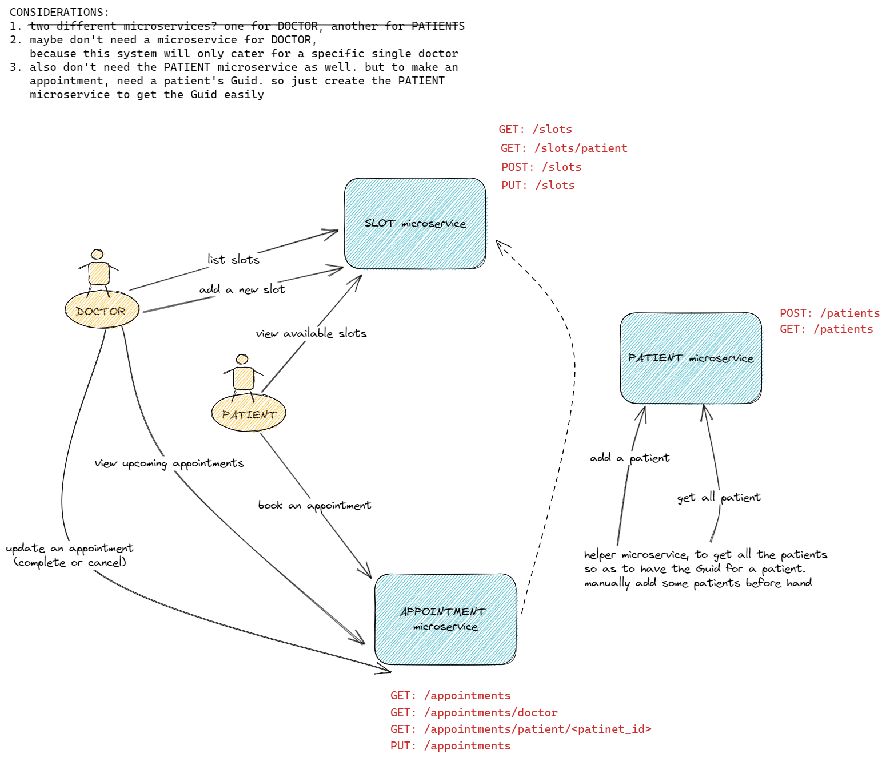

# Doctor Appointment System

## Design and considerations
There will be three microservices:
1. Slot
2. Appointment
3. Patient

Initially I'd like to get rid of both the Doctor and Patient microservices, as the system will only have a single doctor. However, to make an appointment, a patient's Guid will be needed. So the Patient microservice is kept to get a Guid from the patient's information.

Below is the interaction of the components in the system and the APIs.

Microservice | Endpoint | Description
--- | --- | ---
Slot | `GET /slots` | for doctor to list all slots
Slot | `GET /slots/patient` | for patient to view available slots
Slot | `POST /slots` | for doctor to create a new slot
Slot | `PUT /slots` | for Appointment microservice to update the slot
Appointment | `GET /appointments` | to list all Appointments
Appointment | `GET /appointments/doctor` | for doctor to view upcoming Appointments
Appointment | `GET /appointments/patient/<patient_id>` | for a patient to view upcoming Appointments
Appointment | `PUT /appointments` | for a doctor to complete or cancel the appointment
Patient | `POST /patients` | to add a patient
Patient | `GET /patients` | to get all the patients

> By right, need to create these three microservices. To make is simple, here I'm putting them into one single microservice, turning inter-microservice communication into intra-microservice communication.