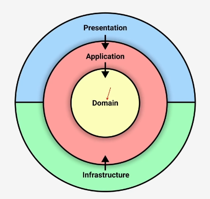
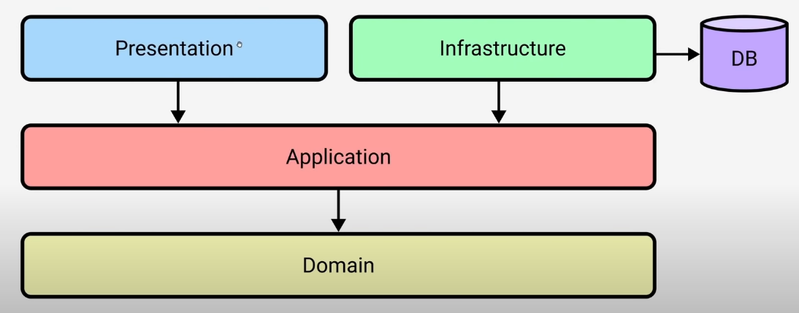
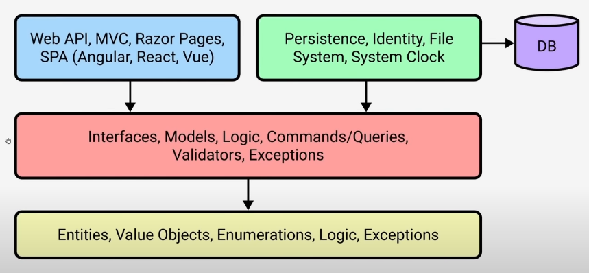
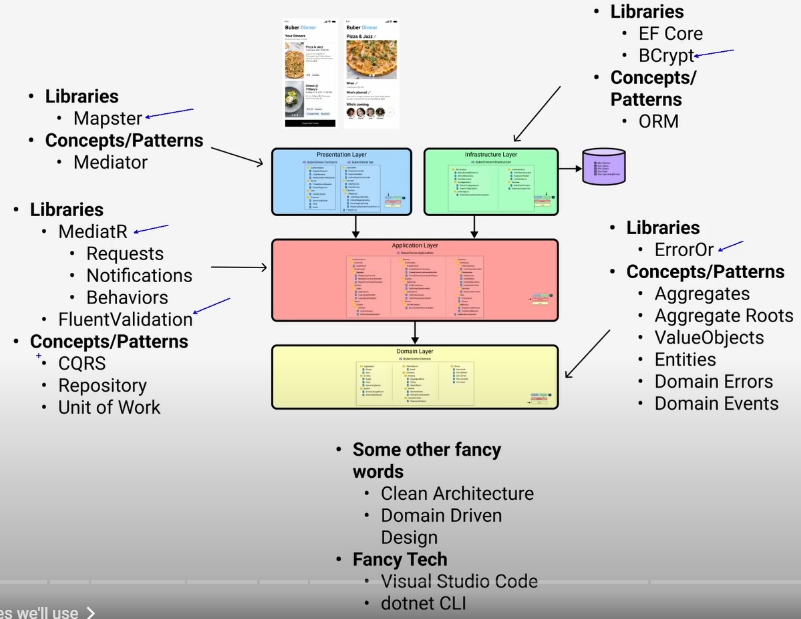

The original clean architecture.



Clean architecture viewed as a layered architecture.



The same as above but more detailed.



The technologies and libraries that used for each layer.




## Dev steps

### Project structure:
- Presentation Layer
    - Api: `webapi` project
    - Contracts: `classlib` project
- Infrastructure Layer
    - Instration: `classlib` project
- Application Layer
    - Application: `classlib` project
- Domain Layer
    - Domain: `classlib` project

> Only the Api project is of `webapi` type, the others are all `classlib` projects.

### Project setup steps:

1. Set up vscode for c# & dotnet development.
    - by installing the C# Dev Kit which includes
        1. The C# extension: provides the base language services support
        2. C# Dev Kit extension: provides solution management, templates, test discovery/debugging
        3. The IntelliCode for C# Dev Kit extension
    - and installing .NET SDK (will be prompted after installing the above dev kit)
2. `dotnet new sln -o doctor-appointment` to createa a solution
    - this will create a folder with a single `doctor-appointment.sln` file
3. Create the projects
    1. `dotnet new webapi -o doctor-appointment.Api` to create the API project
    2. `doctnet new classlib -o doctor-appointment.Contracts` to create the Contracts project
    3. `doctnet new classlib -o doctor-appointment.Infrastructure` to create the Infrastructure project
    4. `doctnet new classlib -o doctor-appointment.Application` to create the Application project
    5. `doctnet new classlib -o doctor-appointment.Domain` to create the Domain project
4. Add the projects to the solution: `doctnet sln add (ls -r *.csproj)`
5. Test with `dotnet build`
6. Add dependencies among the projects
    1. Api depends on Contracts and Application
        - `dotnet add .\doctor-appointment.Api\ reference .\doctor-appointment.Contracts\ .\doctor-appointment.Application\`
        - type `dotnet add *Api` and then `tab` to get `.\doctor-appointment.Api\`
    2. Infrastructure depends on Application
        - `dotnet add .\doctor-appointment.Infrastructure\ reference .\doctor-appointment.Application\`
    3. Application depends on Domain
        - `dotnet add .\doctor-appointment.Application\ reference .\doctor-appointment.Domain\`
    4. Api depends on Infrastructure `// need more information`
        - `dotnet add .\doctor-appointment.Api\ reference .\doctor-appointment.Infrastructure\` 
7. Build again. `dotnet build`
8. Install **REST Client** vscode extension
9. Tese the **WeatherForcastController** in the Api project
    1. `dotnet run --project *Api` to run the Api project

### VS Code Extensions

- Install **C# Namespace Autocompletion** extension so as to automatically fill the namespace.
- Install **NuGet Reverse Package Search ("Add Package" support)** extension, find the package name with this extension
- Add project dependency packages.
    - `dotnet add .\doctor-appointment.Application\ package Microsoft.Extensions.DependencyInjection.Abstractions`
- .Net Watch: for hot reload
  - `dotnet watch --project *API`
- 

### Code the project

1. Start from the Contracts
2. Then create controllers in API
3. Create the Application service
4. Set up Dependency Injection in program.cs. 
    - `builder.Services.AddScoped<ISlotsService, SlotsService>();`
5. Add dependenci injection in each project independently with the help from *Microsoft.Extensions.DependencyInjection.Abstractions*.

To trust the certificate run 'dotnet dev-certs https --trust' (Windows and macOS only)

### Add Serilog

1. Add packages
```bash
dotnet add .\doctor-appointment.Api\ package Serilog.AspNetCore
dotnet add .\doctor-appointment.Api\ package Serilog.Sinks.Console
dotnet add .\doctor-appointment.Api\ package Serilog.Sinks.File 
```
2. Add the following section into *appsettings.json*.
```json
"Serilog": {
    "Using": [ "Serilog.Sinks.File", "Serilog.Sinks.Console" ],
    "MinimumLevel": {
      "Default": "Information",
      "Override": {
        "Microsoft": "Warning",
        "System": "Warning"
      }
    },
    "WriteTo": [
      {
        "Name": "Console"
      },
      {
        "Name": "File",
        "Args": {
          "path": "./logs/log-.txt",
          "rollOnFileSizeLimit": true,
          "formatter": "Serilog.Formatting.Compact.CompactJsonFormatter,Serilog.Formatting.Compact",
          "rollingInterval": "Day"
        }
      }
    ],
    "Enrich": [ "FromLogContext", "WithThreadId", "WithMachineName" ]
  }
```
3. Register the service to the container in *Program.cs*. 
```cs
builder.Host.UseSerilog((context, configuration) =>
	configuration.ReadFrom.Configuration(context.Configuration));
```
4. Use the logger, i.e., in *SlotsController.cs*:
```cs
private readonly ILogger<SlotsController> _logger;

public SlotsController(ISlotsService slotsService, ILogger<SlotsController> logger)
{
	_slotsService = slotsService;
	_logger = logger;
}

[Route("")]
[HttpGet]
public async Task<IActionResult> GetAllSlotsAsync()
{
	_logger.LogInformation("Requesting all slots");
	var slots = await _slotsService.GetAllSlotsAsync();
	return Ok(slots);
}
```

### Set up User Secrets

1. Init: `dotnet user-secrets init --project .\doctor-appointment.Api\`
2. Add a secret: `dotnet user-secrets set "JwtSettings:Secret" "THE-SECRET-COMES-HERE" --project .\doctor-appointment.Api\`
3. To list secrets associated with the project: `dotnet user-secrets list --project .\doctor-appointment.Api\`